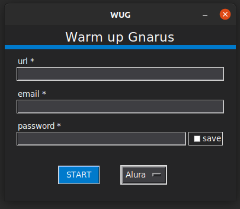

# Gnarus Warm Up

This little project look after to help my workmates warm up the alura's 
env's to be deployed, instead of to click in every little button
now you can drink your coffee and relax a bit by the time this bot can do it for ya :)
You can also contribute to the project by reporting a problem or checking an issue

## to run the project follow the steps bellow

### Py lib's
Selenium

```pip install selenium```

```pip install webdriver-manager```

### Firefox

```sudo apt install firefox-geckodriver```

### tkinter

```sudo apt-get install python3-tk```

### create exec
pyInstaller is used to create a new .exec every time we update or change something in the project,
to do so run the command below 

```pyinstaller --onefile -w main.py```

## If you just want to use the .exe file

with our .exe we will need no lib's
only the Geckodriver that's used to the selenium open and control your firefox

```sudo apt install firefox-geckodriver```

That's it, now you just need to clone the project in any local that you want and run the file WUP/dist/main.exe


